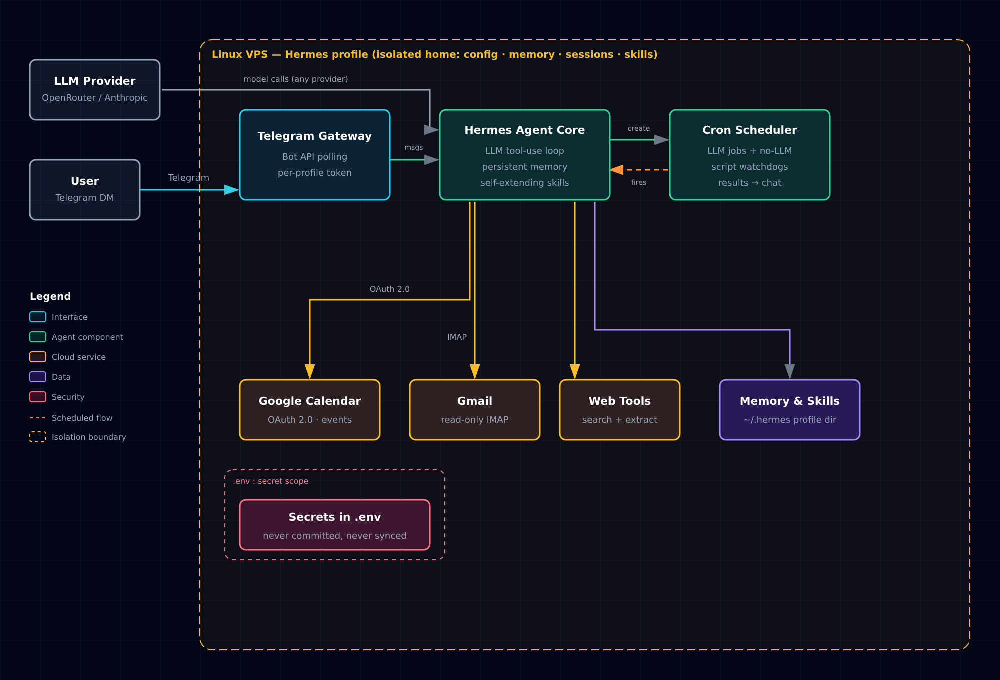

# Personal AI Assistant

A production-grade personal AI assistant built on [Hermes Agent](https://github.com/NousResearch/hermes-agent) — reachable 24/7 over Telegram, wired into Google Calendar and Gmail, running scheduled automations and multi-agent workflows on a headless VPS.

> **Everything shown in this repo runs inside an isolated demo profile with synthetic data.** No personal emails, calendar entries, or credentials are included. See [Privacy model](#privacy-model).

## Features

| Capability | Demo | Notes |
|---|---|---|
| **Calendar-aware assistant** | `demos/calendar-briefing.gif` | Natural-language queries against Google Calendar via OAuth; daily morning briefing delivered to chat |
| **Email triage** | `demos/email-triage.gif` | Read-only Gmail/IMAP access; summarizes the inbox, drafts (never auto-sends) replies |
| **Scheduled jobs from plain text** | `demos/cron-setup.gif` | "Every weekday at 07:25, brief me on my day" → a real cron job is created, managed, and delivered |
| **Script-only watchdogs (no LLM)** | `demos/watchdog-alert.gif` | Cheap scheduled scripts that only wake the LLM when a threshold trips (see `skills/stock-watchdog`) |
| **Multi-agent delegation** | `demos/multi-agent.gif` | Spawns peer Hermes instances for long-running tasks; parent stays responsive |
| **Self-extending skills** | — | The agent writes and reloads its own reusable procedures (`skills/`) |
| **Web & research tools** | `demos/web-research.gif` | Search, extract, and cite sources on request |

## Architecture



Open [`docs/architecture.html`](docs/architecture.html) for the interactive version.

One Hermes profile = one isolated home directory (config, memories, sessions, skills, cron). The assistant core routes between tools; integrations are pluggable.

## Repo layout

```
personal-ai-assistant/
├── README.md
├── SETUP.md                  # step-by-step demo-environment setup
├── docs/
│   ├── architecture.html     # dark-themed SVG architecture diagram
│   └── architecture.svg
├── demos/                    # recorded GIFs of the demo profile (synthetic data only)
│   └── README.md             # recording checklist
├── skills/
│   └── stock-watchdog/       # example custom skill: threshold watchdog + no-LLM cron
├── config-examples/
│   ├── config.example.yaml   # illustrative settings — real config never leaves the VPS
│   └── .env.example          # placeholder secrets
└── cron-examples/
    └── README.md             # example scheduled jobs (LLM and script-only)
```

## Setup (short version)

```bash
# 1. Install Hermes Agent
curl -fsSL https://hermes-agent.nousresearch.com/install.sh | bash

# 2. Create an isolated demo profile (own config, keys, memory, sessions)
hermes profile create demo
demo setup          # pick model/provider, set a NEW Telegram bot token from @BotFather

# 3. Connect integrations (Google OAuth, Telegram gateway) — see SETUP.md
# 4. Record demos with synthetic data only → demos/
```

Full walkthrough in [SETUP.md](SETUP.md).

## Privacy model

- **Demo profile isolation** — a separate Hermes profile holds the demo bot token and nothing else; the production profile's mail, calendar, memories, and session history never touch it.
- **Least privilege** — Gmail integration is read-only; the agent drafts, humans send.
- **Secrets never leave `.env`** — `.env`, real `config.yaml`, `sessions/`, and `state.db` are gitignored; the repo only carries sanitized examples.
- **Synthetic data only** — every screenshot/GIF in `demos/` uses fake events, fake emails, fake tickers.

## Stack

- **Agent framework:** [Hermes Agent](https://github.com/NousResearch/hermes-agent) (open source)
- **Runtime:** Linux VPS (headless), Python 3.11
- **Interfaces:** Telegram Bot API gateway, CLI
- **Integrations:** Google Calendar API (OAuth 2.0), Gmail (read-only IMAP), web search/extraction
- **Automation:** Hermes cron (LLM jobs + script-only no-agent jobs)
- **My work:** integration design, custom skills, automation workflows, multi-agent orchestration, and VPS ops — built on top of the open-source agent framework.

## License

MIT
